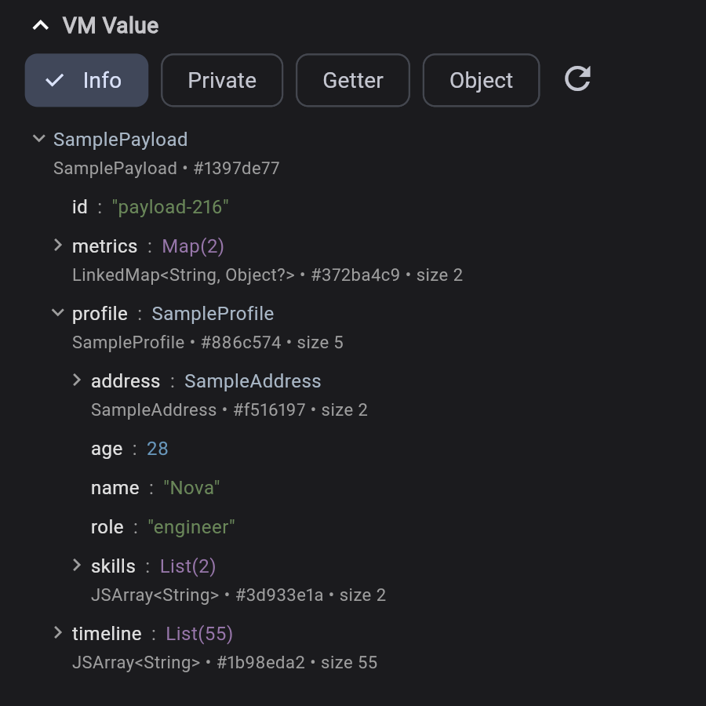
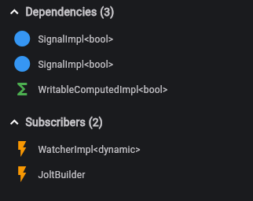
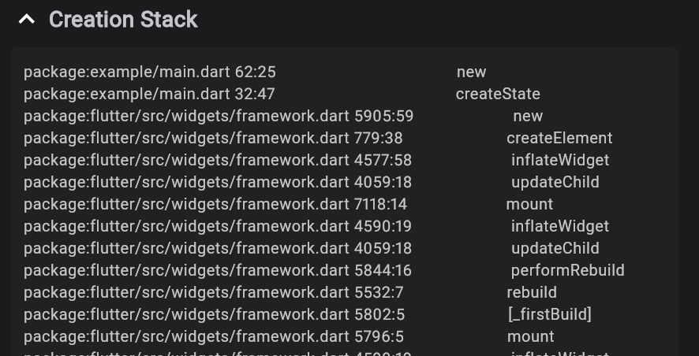

# Jolt DevTools Extension

Jolt DevTools Extension is a powerful Flutter DevTools extension for visualizing and debugging signals, computed values, and effects in the Jolt reactive system.

## Overview


Jolt DevTools Extension provides a complete visualization and management tool for reactive nodes, helping you:

- 🔍 **Search and Filter Nodes** - Powerful query syntax supporting filtering by label, type, ID, and more
- 📊 **Node Details Panel** - View complete node information including values, types, dependencies, and more
- 🔗 **Dependency Visualization** - View node dependencies and subscribers
- 💾 **VM Value Inspection** - Deep dive into actual values in the Dart VM, with support for expanding complex objects
- 📝 **Creation Stack Trace** - View where nodes were created for easier debugging

## Key Features

### 1. Node List and Search

The node list panel displays all reactive nodes (Signal, Computed, Effect) with support for:

- **Real-time Search**: Enter keywords to quickly filter nodes
- **Advanced Query Syntax**: Support for various query operators
  - `label:text` - Search by label
  - `type:Signal` - Filter by type
  - `debug:category` - Filter by debug type
  - `id:123` - Search by ID
  - See the help button for more syntax

### 2. Node Details Panel

Click on a node to view detailed information:

- **Basic Information**: ID, type, debug type, value type, current value
- **VM Value Tree**: Deep dive into actual value structures in the Dart VM
  - Support for expanding/collapsing complex objects
  - Display collections, records, enums, and other types
  - Support for copying values to clipboard
  - Support for refreshing values (re-fetch from VM)



### 3. Dependencies

View node dependencies and subscribers:

- **Dependencies**: Other nodes that this node depends on
- **Subscribers**: Other nodes that subscribe to this node
- Click on relationship nodes to quickly navigate



### 4. Creation Stack Trace

View where nodes were created to help understand code execution flow:



### 5. Interactive Operations

- **Trigger Effects**: Manually trigger Effect execution

## Usage

1. Enable Jolt DevTools in your Flutter app:
   ```dart
   import 'package:jolt/core.dart';
   
   void main() {
     JoltDebug.init();
     runApp(MyApp());
   }
   ```

2. Launch your app and open Flutter DevTools

3. Find the "Jolt Inspector" tab in DevTools

4. Start debugging your reactive system!
