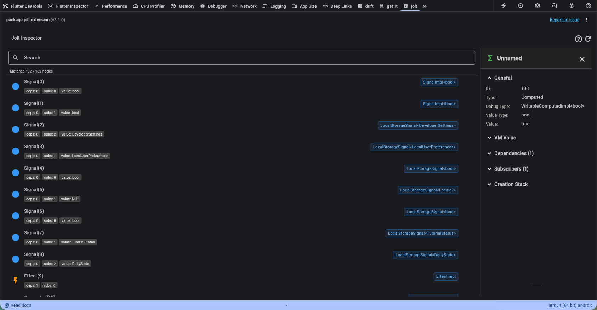
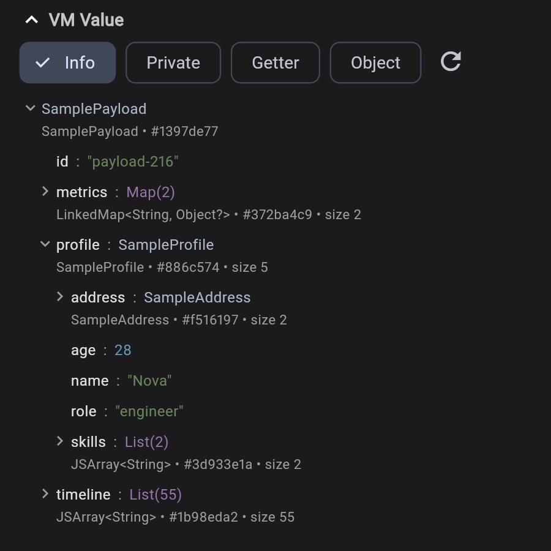
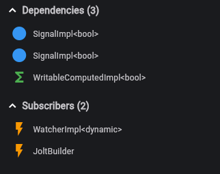
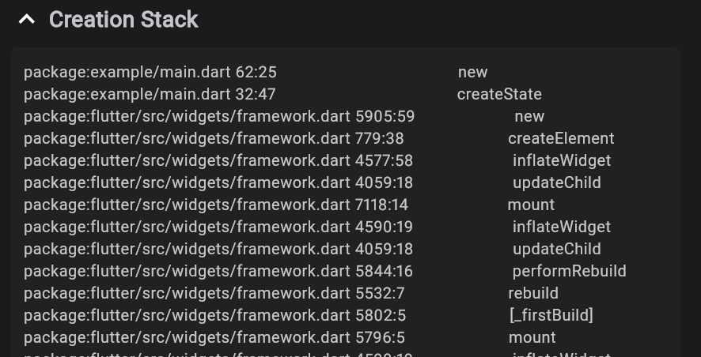

# Jolt DevTools Extension

Jolt DevTools Extension is a powerful Flutter DevTools extension for visualizing and debugging signals, computed values, and effects in the Jolt reactive system.

## Overview



Jolt DevTools Extension provides a complete visualization and management tool for reactive nodes, helping you:

- 🔍 **Search and Filter Nodes** - Powerful query syntax supporting filtering by label, type, ID, and more
- 📊 **Node Details Panel** - View complete node information including values, types, dependencies, and more
- 🔗 **Dependency Visualization** - View node dependencies and subscribers
- 💾 **VM Value Inspection** - Path-driven VM inspection with refresh-safe expansion state and explicit error states
- 📝 **Creation Stack Trace** - View where nodes were created for easier debugging

## Key Features

### 1. Node List and Search

The node list panel displays all reactive nodes (Signal, Computed, Effect) with support for:

- **Real-time Search**: Enter keywords to quickly filter nodes
- **Advanced Query Syntax**: Support for various query operators
  - `label:text` - Search by label
  - `type:Signal` - Filter by type
  - `debug:category` - Filter by debug type
  - `id:123` - Search by ID
  - See the help button for more syntax

### 2. Node Details Panel

Click on a node to view detailed information:

- **Basic Information**: ID, type, debug type, value type, current value
- **VM Value Inspector**: Deep dive into actual value structures in the Dart VM
  - Stable expansion paths are keyed by `JoltValuePath`
  - Refresh keeps the current browsing context whenever the path identity is still valid
  - Values are normalized into `loading`, `unavailable`, `stale`, and `error` states
  - Internal fields and dependency-private fields can be toggled independently
  - Root scalar `Signal` values support controlled inline editing



### VM Value Inspector Architecture

The value section now runs on the dedicated inspector stack in
[`lib/src/inspector_value/`](/Users/vowzero/projects/jolt/packages/jolt_devtools_extension/lib/src/inspector_value):

- `JoltValuePath` provides stable root, field, list-index, and map-entry paths.
- `JoltInspectedValue` converts `vm_service` responses into a UI-oriented value model.
- `JoltValueInspectorService` resolves roots lazily and caches root refs, per-path refs, normalized values, and filtered child rows.
- `JoltValueInspectorRoot` renders the tree directly from path-bound state instead of the old ad-hoc VM tree widgets.

Current write support is intentionally narrow: only root scalar `Signal` values are editable. Nested fields and complex objects remain read-only.

### 3. Dependencies

View node dependencies and subscribers:

- **Dependencies**: Other nodes that this node depends on
- **Subscribers**: Other nodes that subscribe to this node
- Click on relationship nodes to quickly navigate



### 4. Creation Stack Trace

View where nodes were created to help understand code execution flow:



### 5. Interactive Operations

- **Trigger Effects**: Manually trigger Effect execution

## Usage

1. Enable Jolt DevTools in your Flutter app:
   ```dart
   import 'package:jolt/core.dart';
   
   void main() {
     JoltDebug.init();
     runApp(MyApp());
   }
   ```

2. Launch your app and open Flutter DevTools

3. Find the "Jolt Inspector" tab in DevTools

4. Start debugging your reactive system!
